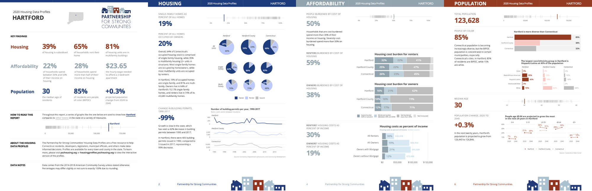

```{r setup, include=FALSE}
knitr::opts_chunk$set(eval = FALSE, 
                      warning = FALSE,
                      message = FALSE,
                      rows.print = 5)
```

```{r eval = TRUE, echo = FALSE}
library(fontawesome)
```


# Before We Start

Please take the survey at https://rfor.us/magicsurvey


---

background-image:url("images/dk-headshot-color-2.jpg")


???

Who Am I?

- Not a hardcore quant: anthro PhD
- Starting using R when I was consulting so I could have a free option to replace Excel, SPSS, etc. Realized R was much more than that.
- Use R for descriptive stats, data visualization, creative reporting
- Realized the power of R and realized people are scared of it. Started RRU to offer training through online courses, training orgs, workshops, etc to help the rest of us learn R.


---

class: inverse, center, middle

# R for the Rest of Us

---

class: inverse, center, middle


---

class: inverse, center, middle


---

class: inverse, center, middle




---

class: inverse, center, middle

# How Do You Normally Do Reporting?

???

Ask people to walk through steps they go through to get, analyze, present, and report on data

---

class: center, middle


???

Problems: 
- What if data changes? 
- What if you need to produce reports for 10 sites?
- What if you need to redo report next year? 
- Lot of manual work > copy-paste errors

---

class: inverse, center, middle

# If You Need to Make Changes, It Feels Like Reversing a River

---

class: center, middle


---

class: inverse, center, middle

# There is a Better Way,<br>I Promise

???

Switch to RStudio + generate report


---

class: center, middle, inverse

# What is This Magic? 

---

class: center, middle

# RMarkdown


???

Combine text and code to produce reports

---

class: center, middle


---

class: center, middle


???

Remember this? You can do it all in one tool: RMarkdown

With RMarkdown, you can do all 4 steps in one document

- Get data
- Analyze data
- Make charts
- Write report
- And you can repeat this process whenever you want

---

class: inverse, center, middle

# Benefits of RMarkdown


---

class: center, middle

.xl[
[A]ll the work is done up front and then for every session ... <b>I only need to spend 15 minutes generating the report and sending it to them.
]


.large[
[Using R for Immediate Reporting in Evaluation by Dana Wanzer](https://danawanzer.com/using-r-for-immediate-reporting-in-evaluation/)
]

---

class: center, middle

# Use Templates to Make Reports Follow Your Branding

---

class: center, middle, inverse


---

class: center, middle

# Make Multiple Reports at Once

---

class: center, middle, inverse


???

There are ~170 of these

https://housingprofiles.pschousing.org/
https://rfortherestofus.com/success-stories/pschousing/

---

class: center, middle

# Make Interactive Reports

---

class: center, middle, inverse


???

https://foodmap.apicouncil.org/

---


class: center, middle

# Make Presentations

???

Show these slides
Say how people can write report and then make a few changes to have presentation ready

---

class: center, middle

# Send Email

???

Check your email!

---

class: inverse, center, middle

# R is More Than Just a Replacement for Your Current Data Analysis Tool

---

class: inverse, center, middle

# A Lot More

---

class: center, middle

# At Its Core, R is About Improving Your Workflow 


---

class: center, middle

.xl[
No matter if you’re doing complex statistical analysis or you’re producing tables of descriptive stats, R can help you produce and share your results more efficiently than any other tool. 
]


---

class: center, middle


# The Best Reason to Learn R

---

class: center, middle


---

class: middle

.pull-left[

]
.pull-right[
<br><br><br><br><br><br>
.large[
#### `r fa("envelope", fill = "#6cabdd")`  [david@rfortherestofus.com](mailto:david@rfortherestofus.com) 

#### `r fa("twitter", fill = "#6cabdd")`  [dgkeyes](twitter.com/dgkeyes)

#### `r fa("twitter", fill = "#6cabdd")`  [rfortherest](twitter.com/rfortherest)
]
]
